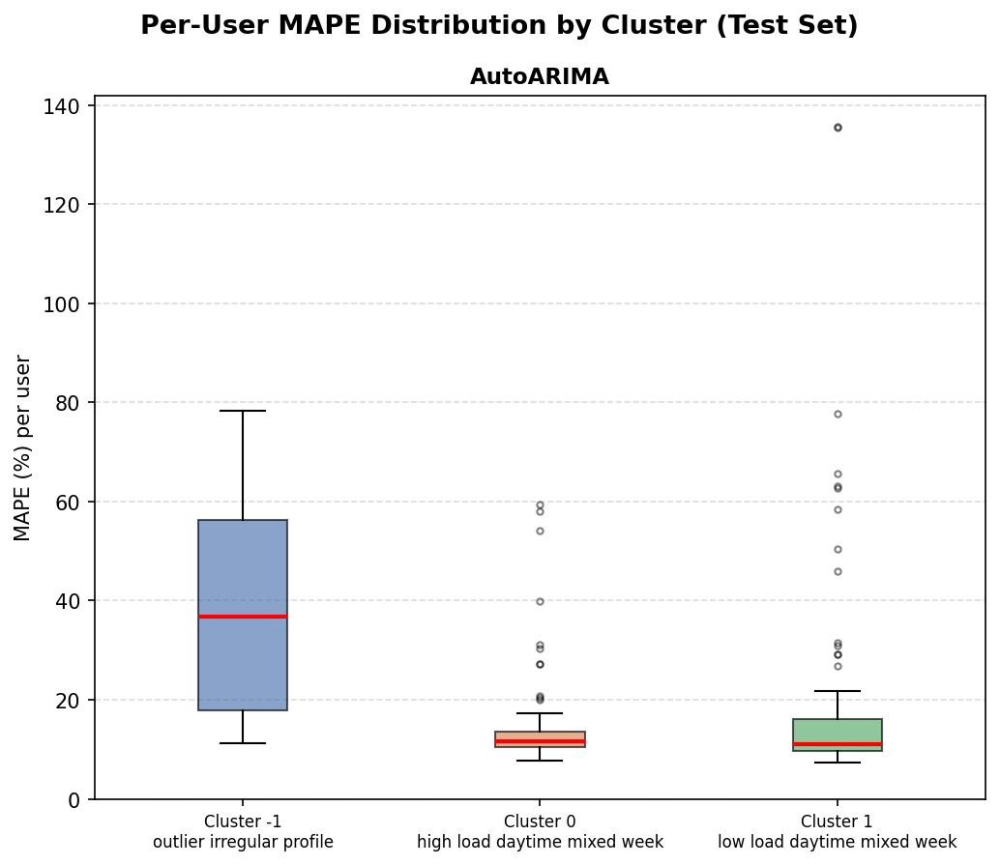
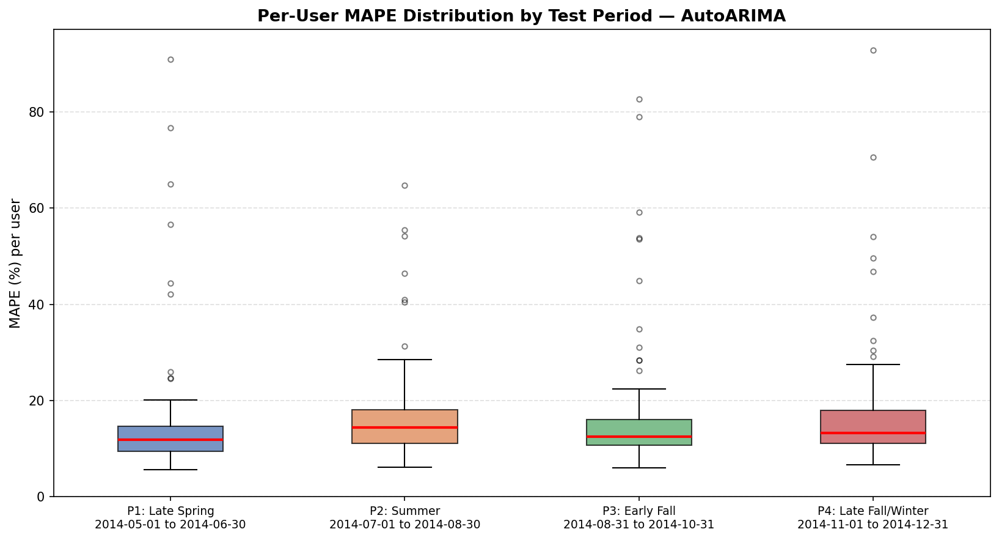
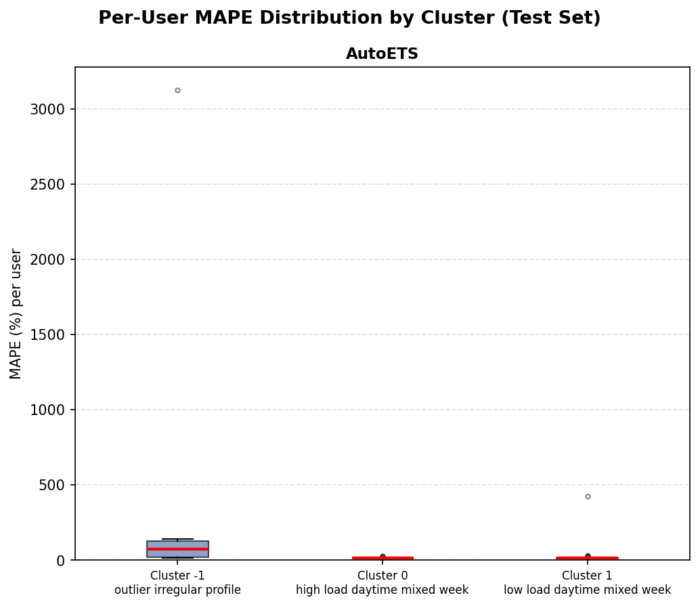
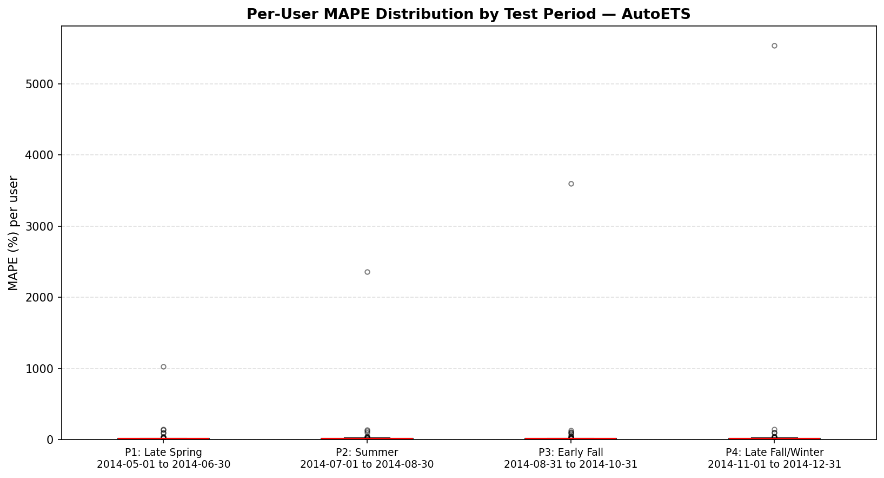
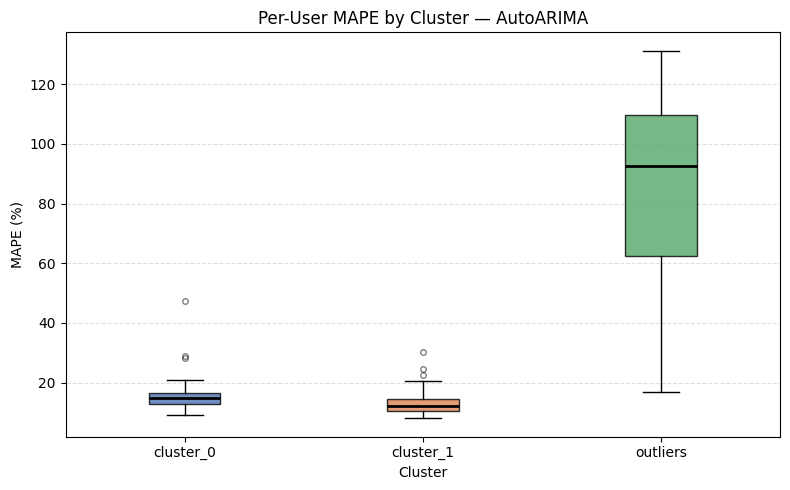
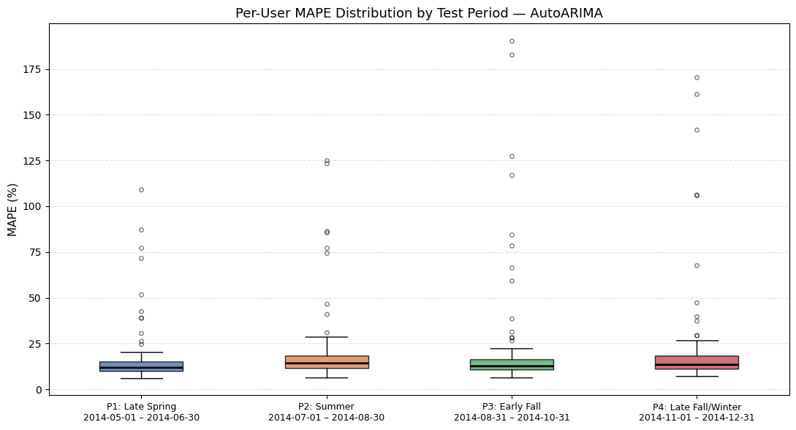
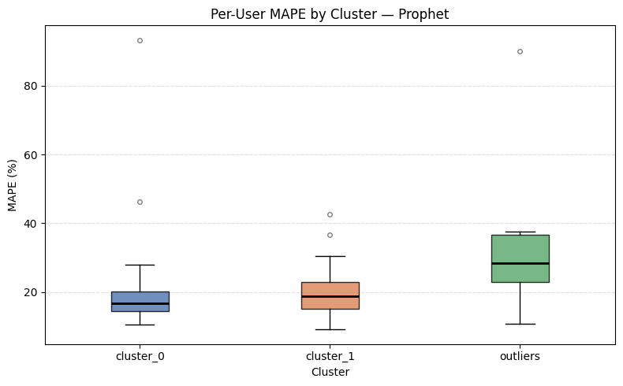
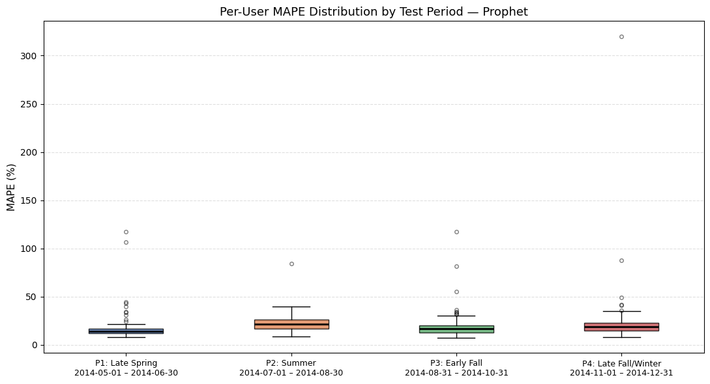
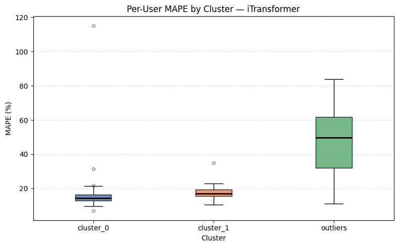
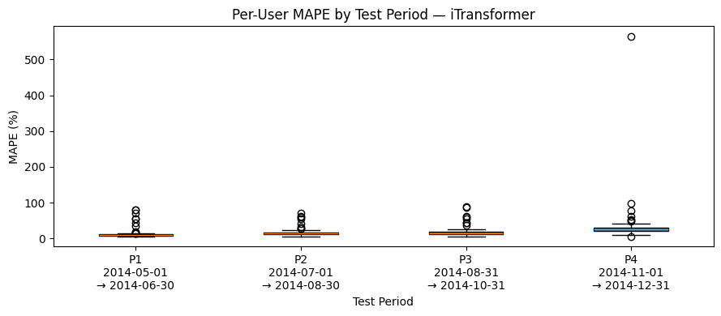

# Electricity Load Forecasting Preprocessing (LD2011-2014)

Reproducible preprocessing pipeline for `LD2011_2014.txt`.
Scope is preprocessing **Step 1-3** only.

## 1) What This Repository Produces

- Hourly wide master dataset (active clients only)
- Metadata describing preprocessing rules and removed entities
- Optional aggregate series
- CSV exports for model teams (Level 1/2/3)

## 2) Preprocessing Rules

- Input resolution: 15-min (`kW`)
- Target definition: `hourly_kW_mean_of_4`
- Processing order: downsample/filter in wide format before any melt
- DST policy: drop entire transition dates
- Inactive client filter:
  - `nonzero_rate < 0.01`, or
  - `max_consecutive_zeros_hours > 720`
- Numeric parsing: `decimal=','` (required for this dataset)

## 3) Run

```bash
make run
```

or

```bash
/Library/Frameworks/Python.framework/Versions/3.11/bin/python3 run_pipeline.py --config config.json
```

## 4) Test

```bash
make test
```

## 5) Complete File Inventory (Current)

### Root files

- `.gitignore`: ignore cache artifacts (`__pycache__`, `*.pyc`, `.DS_Store`)
- `LICENSE`: MIT license
- `Makefile`: run/test/clean commands
- `README.md`: project documentation
- `config.json`: pipeline configuration (input path, rules, output names)
- `requirements.txt`: Python dependencies
- `run_pipeline.py`: main CLI entrypoint (Step 1 -> Step 2 -> Step 3)
- `run_clustering_pipeline.py`: clustering CLI entrypoint (train-only user clustering + evaluation protocol export)
- `preprocess_ld.py`: legacy single-file runner (kept for compatibility)

### Source package (`src/ld_preprocessing`)

- `__init__.py`: package marker
- `pipeline.py`: orchestration logic and metadata assembly
- `step1_load_integrity.py`: Step 1 (load, parse, integrity checks)
- `step2_hourly_dst_inactive.py`: Step 2 (hourly downsample, DST drop, inactive filtering)
- `step3_save_outputs.py`: Step 3 (save master + metadata + optional aggregate)

### Source package (`src/clustering_pipeline`)

- `__init__.py`: package marker
- `features.py`: train-only user feature engineering for clustering
- `evaluation.py`: fixed evaluation protocol helpers (`MAPE_0_100`, equal-size test periods)
- `pipeline.py`: clustering orchestration, cluster selection, mapping, and summary export

### Tests (`tests`)

- `test_step1.py`: Step 1 unit tests
- `test_step2.py`: Step 2 unit tests
- `test_step3.py`: Step 3 unit tests
- `test_pipeline.py`: end-to-end pipeline test on tiny synthetic data
- `tests/__pycache__/...`: auto-generated cache files (not source)
- `test_clustering_pipeline.py`: clustering feature extraction, equal-size periods, and export tests

### Generated output data

Core parquet outputs:
- `master_wide_hourly.parquet`: main preprocessed dataset (timestamp x active clients)
- `master_metadata.json`: preprocessing metadata/reproducibility record
- `aggregate_hourly.parquet`: optional aggregate series

CSV exports:
- `master_wide_hourly.csv`: CSV version of hourly wide master
- `aggregate_hourly.csv`: CSV version of aggregate series
- `calendar_features_hourly.csv`: timestamp-level calendar features for exogenous models
- `master_long_hourly.csv`: long-format panel (`timestamp`, `client_id`, `y`)
- `active_clients.csv`: active client ID list

Clustering artifacts:
- `artifacts/clustering/cluster_feature_table.csv`: per-user train-only clustering features
- `artifacts/clustering/cluster_model_selection.csv`: candidate `k` values with silhouette/min cluster size diagnostics
- `artifacts/clustering/cluster_k_comparison.csv`: side-by-side cluster summaries for `k=2` and `k=3`
- `artifacts/clustering/user_cluster_mapping.csv`: user-to-cluster mapping
- `artifacts/clustering/cluster_summary.csv`: cluster-level summary statistics and interpretations
- `artifacts/clustering/evaluation_protocol.json`: fixed split metadata and equal-size test periods
- `artifacts/clustering/figures/index.html`: one-page visual summary of the clustering results
- `artifacts/clustering/figures/cluster_size_bar.svg`: cluster size bar chart
- `artifacts/clustering/figures/cluster_daily_profile.svg`: average 24-hour profile by cluster
- `artifacts/clustering/figures/cluster_pca_scatter.svg`: 2D PCA projection of users colored by cluster
- `artifacts/clustering/figures/cluster_pca_regular_only.svg`: PCA projection with outliers removed to inspect the main clusters more clearly

## 6) CSV Usage by Model Level

1. Level 1: Pure Endogenous Baselines (AutoARIMA, AutoETS)
- Use: `master_long_hourly.csv` (`unique_id`, `ds`, `y` format expected by statsforecast)
- Optional: `aggregate_hourly.csv` for single-series benchmark

2. Level 2: Covariate Baselines (SARIMAX, Prophet)
- Use: `master_long_hourly.csv` + `calendar_features_hourly.csv` (join on `timestamp`)

3. Level 3: Global Deep Learning (e.g. iTransformer)
- Use: `master_wide_hourly.csv` (each client column is a variate for multivariate models)
- Join: `calendar_features_hourly.csv` on `timestamp`
- Optional indexing helper: `active_clients.csv`

## 7) GitHub Upload

```bash
git add .
git commit -m "Finalize LD2011-2014 preprocessing repo (steps 1-3)"
git push
```

## 8) Time-Based Data Split (Train / Validation / Test)

We additionally provide fixed chronological splits for model development:

- **Train:** January 2012 – December 2013  
- **Validation:** January 2014 – April 2014  
- **Test:** May 2014 – December 2014  

All split boundaries are inclusive at hourly resolution:
- Train: `2012-01-01 00:00:00` to `2013-12-31 23:00:00`
- Validation: `2014-01-01 00:00:00` to `2014-04-30 23:00:00`
- Test: `2014-05-01 00:00:00` to `2014-12-31 23:00:00`

No timestamp overlap exists between the three splits.

### Wide-format split files

- `master_wide_hourly_train_2012_2013.csv` — shape `(17448, 156)`
- `master_wide_hourly_validation_2014_01_04.csv` — shape `(2856, 156)`
- `master_wide_hourly_test_2014_05_12.csv` — shape `(5856, 156)`

### Long-format split files

- `master_long_hourly_train_2012_2013.csv` — shape `(2721888, 3)`
- `master_long_hourly_validation_2014_01_04.csv` — shape `(445536, 3)`
- `master_long_hourly_test_2014_05_12.csv` — shape `(913536, 3)`

## 9) Clustering Pipeline

This repository now includes a baseline clustering scaffold for the updated project requirements. The clustering stage uses **training data only** (`2012-01-01` to `2013-12-31`) to avoid leakage into validation or test periods.

### Run

```bash
make cluster
```

or

```bash
/Library/Frameworks/Python.framework/Versions/3.11/bin/python3 run_clustering_pipeline.py
```

### What it does

- Builds per-user clustering features from the training split only
- Uses pattern-oriented clustering features by default:
  - normalized hourly profile
  - normalized weekday profile
  - normalized monthly profile
  - `weekend_ratio`, `day_night_ratio`, `peak_hour`
- Separates irregular users with `IsolationForest` before fitting the main clusters
- Evaluates candidate cluster counts (`k=2..8`) using silhouette score
- Exports a user-to-cluster mapping
- Exports cluster summary statistics and interpretation labels
- Exports an evaluation protocol JSON with:
  - fixed train / validation / test windows
  - `MAPE_0_100` as the main metric
  - four **equal-size** test periods

### Equal-size test periods (4-way split)

To satisfy the updated project requirement that testing regions be the same size, the test set is divided into the following four equal-size hourly periods:

- Period 1: `2014-05-01 00:00:00` to `2014-06-30 23:00:00` (`1464` hours)
- Period 2: `2014-07-01 00:00:00` to `2014-08-30 23:00:00` (`1464` hours)
- Period 3: `2014-08-31 00:00:00` to `2014-10-31 23:00:00` (`1464` hours)
- Period 4: `2014-11-01 00:00:00` to `2014-12-31 23:00:00` (`1464` hours)

### Notes

- Default outlier handling uses `IsolationForest(contamination=0.05)`.
- `cluster_model_selection.csv` should be reviewed before finalizing the production cluster count.
- The current scaffold is intended to accelerate experimentation; outlier handling and cluster-specific forecasting still need to be refined for the final submission.

### Where to inspect the results

- Start with `artifacts/clustering/figures/index.html` for the easiest visual summary.
- Use `artifacts/clustering/cluster_summary.csv` for the cluster-level numeric summary.
- Use `artifacts/clustering/user_cluster_mapping.csv` to check the assigned cluster for a specific consumer ID.
- Use `artifacts/clustering/cluster_model_selection.csv` to explain why the current `k` was selected.
- Use `artifacts/clustering/cluster_k_comparison.csv` to compare the practical difference between `k=2` and `k=3`.

## 10) Modeling Step 1 (`src/modeling_step1/`)

Three forecasting models are implemented for **24-hour-ahead** electricity load forecasting across 156 active clients, with an additional aggregate single-series benchmark.

### Models

#### AutoETS.ipynb — AutoETS (Level 1)

- Library: `statsforecast`
- Format: long-format (`master_long_hourly_*.csv`)
- Training window: last 672 hours (4-week lookback) per client
- Exogenous features: None
- Season length: 24 (daily); automatically selects error, trend, seasonality components
- Parallel training: `n_jobs=-1`
- Saved models: `autoets_val.joblib`, `autoets_final.joblib`

**Test results (156 clients, overall):** MSE = 612,003 | MAE = 145.52 | WAPE = 0.213

#### AutoARIMA.ipynb — AutoARIMA (Level 1)

- Library: `statsforecast` `AutoARIMA`
- Format: single time series (`master_long_hourly_*.csv`)
- Training window: last 672 hours (4-week lookback) per client
- Exogenous features: None
- Season length: 24 (daily); stepwise + approximation enabled for speed
- Parallel training: `n_jobs=-1`
- Saved models: `autoarima_val.joblib`, `autoarima_final.joblib`

**Test results (156 clients, overall):** MSE = 155,072 | MAE = 99.11 | WAPE = 0.145

#### AutoARIMA_Aggregate.ipynb — AutoARIMA (Level 1)

- Library: `statsforecast` `AutoARIMA`
- Format: long-format (`aggregate_hourly.csv`)
- Training window: last 672 hours (4-week lookback)
- Exogenous features: None
- Season length: 24 (daily); stepwise + approximation enabled for speed
- Saved models: `autoarima_agg_val.joblib`, `autoarima_agg_final.joblib`

**Test results (aggregate series):** MSE = 203,562,485 | MAE = 10,726.18 | WAPE = 0.100

### Model Comparison (Test Set)

| Model | Test MSE | Test MAE | Test WAPE |
|-------|----------|----------|-----------|
| AutoETS | 612,003 | 145.52 | 0.213 |
| AutoARIMA | 155,072 | 99.11 | 0.145 |
| AutoARIMA(agg) | 203,562,485 | 10,726.18 | 0.100 |

AutoARIMA outperformed AutoETS (WAPE 0.213); AutoETS likely anchored on the late December 2013 consumption peak, causing persistent overestimation early in the validation period. Aggregate benchmark (WAPE 0.1004) showed lower error than per-client (WAPE 0.1448)

## 11) Modeling Step 2 (`src/modeling_step2/`)

Two covariate forecasting models are implemented for **24-hour-ahead** electricity load forecasting across 156 active clients.

### Models

#### SARIMAX.ipynb — AutoARIMA (Level 2)

- Library: `statsforecast` `AutoARIMA`
- Format: long-format (`master_long_hourly_*.csv`)
- Training window: last 672 hours (4-week lookback) per client
- Exogenous features: `hour_sin/cos`, `dow_sin/cos`, `is_weekend`, `month_sin/cos`
- Season length: 24 (daily); stepwise + approximation enabled for speed
- Parallel training: `n_jobs=-1`
- Saved models: `sarimax_val.joblib`, `sarimax_final.joblib`

**Test results (156 clients, overall):** MSE = 267,842 | MAE = 134.84 | WAPE = 0.197

#### Prophet.ipynb — Prophet (Level 2)

- Library: `prophet`
- Format: long-format (`master_long_hourly_*.csv`)
- One independent model per client (156 models total)
- Seasonalities: daily, weekly, yearly (additive mode)
- Exogenous regressor: `is_weekend`
- Saved models: `prophet_val.joblib`, `prophet_final.joblib`

**Test results (156 clients, overall):** MSE = 256,237 | MAE = 113.45 | WAPE = 0.166

### Model Comparison (Test Set)

| Model | Test MSE | Test MAE | Test WAPE |
|-------|----------|----------|-----------|
| Prophet | **256,237** | **113.45** | **0.166** |
| AutoARIMA | 267,842 | 134.84 | 0.197 |

Prophet outperforms AutoARIMA on all metrics at the covariate level.

## 12) Modeling Step 3 (`src/modeling_step3/`)

A global deep learning model is implemented for **720-hour-ahead** (rolling chunk) electricity load forecasting across all 156 active clients simultaneously.

### Models

#### iTransformer.ipynb — iTransformer (Level 3)

- Library: `neuralforecast` `iTransformer`
- Format: wide-format (`master_wide_hourly_*.csv`) converted to long format for NeuralForecast
- Global model shared across all 156 clients
- Chunk horizon: 720 h (~1 month) | Input size: 672 h (4-week lookback)
- Rolling prediction: each chunk's predictions are appended as history before the next chunk
- Architecture: hidden=512, heads=8, encoder layers=2, decoder layers=1, d_ff=2048, dropout=0.1
- Loss: MSE (train) / MAE (validation); early stopping patience=10 steps, val check every 100 steps
- Exogenous features: `hour_sin/cos`, `dow_sin/cos`, `is_weekend`, `month_sin/cos`
- Scaler: standard (per-series normalization)
- ~7.0M trainable parameters
- Saved model: `itransformer_val/`

**Train results (in-sample proxy, 156 clients, overall):** MSE = 145,888 | MAE = 80.49 | WAPE = 0.110

**Validation results (156 clients, overall):** MSE = 60,358 | MAE = 68.94 | WAPE = 0.112

**Test results (156 clients, overall):** MSE = 228,639 | MAE = 119.89 | WAPE = 0.175

### Model Comparison (Test Set)

| Model | Test MSE | Test MAE | Test WAPE |
|-------|----------|----------|-----------|
| iTransformer | 228,639 | 119.89 | 0.175 |

## 13) Overall Model Comparison (Test Set)

| Level | Model | Test MSE | Test MAE | Test WAPE |
|-------|-------|----------|----------|-----------|
| 1 | AutoETS | 612,003 | 145.52 | 0.213 |
| 1 | AutoARIMA | 155,072 | 99.11 | **0.145** |
| 1 | AutoARIMA (agg) | 203,562,485 | 10,726.18 | 0.100 |
| 2 | SARIMAX | 267,842 | 134.84 | 0.197 |
| 2 | Prophet | 256,237 | 113.45 | 0.166 |
| 3 | iTransformer | 228,639 | 119.89 | 0.175 |

Per-client AutoARIMA (Level 1) achieves the best WAPE (0.145) among all per-client models, followed by Prophet (Level 2, 0.166) and iTransformer (Level 3, 0.175). iTransformer outperforms SARIMAX and AutoETS but underperforms both AutoARIMA and Prophet. All models show high per-client variance; outlier clients (e.g., MT_196, MT_279, MT_208) with large absolute loads produce significantly elevated errors.

## 14) Modeling Step 4 (`src/modeling_step4/`)

### Models

#### AutoARIMA_Cluster.ipynb — AutoARIMA on Cluster-Aggregated Series (Level 1)

- Library: `statsforecast` `AutoARIMA`
- Format: long-format (`master_long_hourly_*.csv`)
- Cluster strategy: 8 outlier users → individual models; `cluster_0` (84 users) + `cluster_1` (64 users) → one averaged series each = **10 models total**
- Lookback: 672 h (4-week window) | Season length: 24
- Exogenous features: none (pure endogenous)
- Parameters: `approximation=True`, `stepwise=True`
- Retrained on train+val before final test evaluation

**Test results — Overall:** MSE = 141,250 | MAE = 94.56 | MAPE = 15.333 | WAPE = 0.138

**Test results — By Period:**

| Period   | Date Range                    | MAPE   |
|----------|-------------------------------|--------|
| Period 1 | 2014-05-01 → 2014-06-30       | 14.07% |
| Period 2 | 2014-07-01 → 2014-08-30       | 15.99% |
| Period 3 | 2014-08-31 → 2014-10-31       | 15.21% |
| Period 4 | 2014-11-01 → 2014-12-31       | 16.09% |

#### AutoETS_Cluster.ipynb — AutoETS on Cluster-Aggregated Series (Level 1)

- Library: `statsforecast` `AutoETS`
- Format: long-format (`master_long_hourly_*.csv`)
- Cluster strategy: 8 outlier users → individual models; `cluster_0` (84 users) + `cluster_1` (64 users) → one averaged series each = **10 models total**
- Lookback: 672 h (4-week window) | Season length: 24
- Exogenous features: none (pure endogenous)
- Parameters: `season_length=24`
- Retrained on train+val before final test evaluation
- Note: Outlier users (cluster -1) produce extreme MAPE values due to near-zero consumption causing numerical instability in ETS error calculation

**Test results — Overall:** MSE = 428,118 | MAE = 129.38 | MAPE = 35.963 | WAPE = 0.189

**Test results — By Period:**

| Period   | Date Range                    | MAPE   |
|----------|-------------------------------|--------|
| Period 1 | 2014-05-01 → 2014-06-30       | 21.52% |
| Period 2 | 2014-07-01 → 2014-08-30       | 31.40% |
| Period 3 | 2014-08-31 → 2014-10-31       | 38.47% |
| Period 4 | 2014-11-01 → 2014-12-31       | 52.80% |

### Error Distribution (Box Plots)

AutoARIMA achieves an overall MAPE of 15.3% with stable error distribution across all periods (14–16%), while AutoETS scores 35.9% overall — largely driven by outlier users where near-zero consumption values cause ETS to produce extreme errors (up to 3,100%).

**AutoARIMA**

 

**AutoETS**

 


## 15) Modeling Step 5 (`src/modeling_step5/`)

Cluster-aggregated covariate forecasting following a three-stage pipeline:

1. **Aggregate** — all users assigned to a cluster are averaged into a single representative series per cluster. This reduces noise and produces a smoother signal for the model to learn from.
2. **Train** — one SARIMAX/Prophet model is fitted on each cluster-averaged series (plus one individual model per outlier user). The model learns the shared temporal pattern of the cluster.
3. **Disaggregate** — at prediction time the cluster-level forecast is broadcast unchanged to every user in that cluster. Each user in the same cluster therefore receives the same predicted value, which approximates their individual load via the cluster mean.

Outlier users (cluster -1) bypass aggregation entirely and each receive their own individually fitted model.

### Models

#### SARIMAX_cluster.ipynb — AutoARIMA on Cluster-Aggregated Series (Level 2)

- Library: `statsforecast` `AutoARIMA`
- Format: long-format (`master_long_hourly_*.csv`)
- Cluster strategy: 8 outlier users → individual models; `cluster_0` (84 users) + `cluster_1` (64 users) → one averaged series each = **10 models total**
- Lookback: 672 h (4-week window) | Season length: 24
- Exogenous features: `hour_sin/cos`, `dow_sin/cos`, `is_weekend`, `month_sin/cos`
- Parameters: `approximation=True`, `stepwise=True`
- Retrained on train+val before final test evaluation

**Test results — Overall:** MSE = 256,005 | MAE = 126.42 | MAPE = 17.63 | WAPE = 0.185

**Test results — By Period:**

| Period   | Date Range                    | MAPE   |
|----------|-------------------------------|--------|
| Period 1 | 2014-05-01 → 2014-06-30       | 14.93% |
| Period 2 | 2014-07-01 → 2014-08-30       | 18.19% |
| Period 3 | 2014-08-31 → 2014-10-31       | 18.44% |
| Period 4 | 2014-11-01 → 2014-12-31       | 19.00% |

---

#### Prophet_cluster.ipynb — Prophet on Cluster-Aggregated Series (Level 2)

- Library: `prophet`
- Format: long-format (`master_long_hourly_*.csv`)
- Cluster strategy: 8 outlier users → individual models; `cluster_0` (84 users) + `cluster_1` (64 users) → one averaged series each = **10 models total**
- Seasonalities: daily, weekly, yearly (additive mode)
- Exogenous regressors: `is_weekend` + cyclic `hour_sin/cos`, `dow_sin/cos`, `month_sin/cos`
- Retrained on train+val before final test evaluation

**Test results — Overall:** MSE = 131,658 | MAE = 97.50 | MAPE = 19.57 | WAPE = 0.143

**Test results — By Period:**

| Period   | Date Range                    | MAPE   |
|----------|-------------------------------|--------|
| Period 1 | 2014-05-01 → 2014-06-30       | 16.34% |
| Period 2 | 2014-07-01 → 2014-08-30       | 22.00% |
| Period 3 | 2014-08-31 → 2014-10-31       | 18.44% |
| Period 4 | 2014-11-01 → 2014-12-31       | 21.52% |

### Error Distribution (Box Plots)

SARIMAX achieves a lower overall MAPE (17.6%) with more stable period-to-period variance compared to Prophet (19.6%). Prophet produces lower MSE and WAPE overall, reflecting its robustness to seasonal patterns even when trained on cluster-averaged series.

**SARIMAX**

 

**Prophet**

 


## 16) Modeling Step 6 (`src/modeling_step6/`)

Cluster-based iTransformer forecasting: one iTransformer model is trained per cluster using the per-user data of all cluster members simultaneously as a multivariate input. No series aggregation is performed; each model attends across all users in its cluster.

iTransformer's core mechanism is **inverted attention across variates** — it treats each time series as a token and learns cross-series correlations. A model with only one series provides no cross-variate signal to attend over, making single-client training meaningless for this architecture. The 8 outlier users are therefore grouped into a single model so that iTransformer has at least a small set of variates to learn from, even though these users share no coherent consumption pattern.

### Models

#### iTransformer_cluster.ipynb — iTransformer per Cluster (Level 3)

- Library: `neuralforecast` `iTransformer`
- Format: long-format converted to wide for NeuralForecast; each cluster trained independently
- Cluster strategy: `cluster_0` (84 users), `cluster_1` (64 users), `outliers` (8 users) → **3 separate NeuralForecast instances**
- Chunk horizon: 720 h (~1 month) | Input size: 672 h (4-week lookback)
- Rolling prediction: each 720 h chunk's predictions are appended as history before the next chunk
- Architecture: `hidden=512`, `n_heads=8`, `e_layers=2`, `d_layers=1`, `d_ff=2048`, `dropout=0.1`
- Loss: MSE (train) / MAE (validation); early stopping `patience=10 steps`, `val_check=100 steps`
- Exogenous features: `hour_sin/cos`, `dow_sin/cos`, `is_weekend`, `month_sin/cos`
- Scaler: standard (per-series normalization)
- Saved models: `itransformer_val_{cluster}/`, `itransformer_final_{cluster}/`

**Train results (in-sample proxy, 156 clients, overall):** MSE = 96,635 | MAE = 73.81 | MAPE = 22.66 | WAPE = 0.119

**Validation results (156 clients, overall):** MSE = 70,836 | MAE = 74.43 | MAPE = 17.87 | WAPE = 0.121

**Test results — Overall:** MSE = 157,620 | MAE = 98.25 | MAPE = 18.11 | WAPE = 0.144

**Test results — By Period:**

| Period   | Date Range                    | Mean MAPE | Median MAPE |
|----------|-------------------------------|-----------|-------------|
| Period 1 | 2014-05-01 → 2014-06-30       | 12.09%    | 9.56%       |
| Period 2 | 2014-07-01 → 2014-08-30       | 15.60%    | 13.96%      |
| Period 3 | 2014-08-31 → 2014-10-31       | 16.87%    | 14.66%      |
| Period 4 | 2014-11-01 → 2014-12-31       | 29.74%    | 25.02%      |

### Error Distribution (Box Plots)

iTransformer achieves the lowest mean MAPE across the first three test periods (12–17%) among all cluster-based models, but degrades sharply in Period 4 (late fall/winter, 29.7%) — consistent with the pattern seen in non-clustered iTransformer. Cluster-level training visibly compresses the per-user MAPE distribution compared to the single global model.

 


## 17) Model Comparison Summary

### Overall Test MAPE

| Step | Model | MAPE |
|------|-------|------|
| Step 4 | AutoARIMA (Level 1) | 15.333 |
| Step 4 | AutoETS (Level 1) | 35.963 |
| Step 5 | SARIMAX (Level 2) | 17.63 |
| Step 5 | Prophet (Level 2) | 19.57 |
| Step 6 | iTransformer (Level 3) | 18.11 |

### Test MAPE by Period

| Model | Period 1 | Period 2 | Period 3 | Period 4 |
|-------|----------|----------|----------|----------|
| AutoARIMA (Level 1) | 14.07% | 15.99% | 15.21% | 16.09% |
| AutoETS (Level 1) | 21.52% | 31.40% | 38.47% | 52.80% |
| SARIMAX (Level 2) | 14.93% | 18.19% | 18.44% | 19.00% |
| Prophet (Level 2) | 16.34% | 22.00% | 18.44% | 21.52% |
| iTransformer (Level 3) | 12.09% | 15.60% | 16.87% | 29.74% |

## 18) Interactive Dashboard (`dashboard/`)

### Model Weights

The dashboard requires pre-trained model weights that are **not tracked by git**. Before running the app, create a `model_weights/` directory in the project root and place the following zip files inside:

```
model_weights/
├── AutoARIMA_models.zip      # from src/modeling_step4/
├── AutoETS_models.zip        # from src/modeling_step4/
├── SARIMAX_models.zip        # from src/modeling_step5/
├── Prophet_models.zip        # from src/modeling_step5/
└── itransformer_models.zip   # from src/modeling_step6/
```

These zips are produced by the training notebooks in `src/modeling_step4/` through `src/modeling_step6/`.

A two-page Streamlit application combining an AI forecasting agent with an interactive model comparison dashboard.

**Page 1 — AI Forecasting Agent:** Natural-language chat interface powered by Google Gemini 2.5 Flash. Users describe a consumer and horizon in plain text (e.g. "forecast MT_001 for the next 48 hours"); the agent looks up the consumer's cluster, selects the best model by MAPE, runs the forecast, and renders a Plotly chart with mean/peak metrics inline.

**Page 2 — Model Comparison:** Interactively compare all 5 model predictions against actual values for any of the 156 clients across any date range in the test period (May–December 2014). Displays per-client MAPE and WAPE metric cards for the selected period, a side-by-side Metrics Comparison table above the chart, and an interactive Plotly line chart of actual vs predicted load.

Both pages use cluster-based forecasting (Steps 4–6): cluster_0 and cluster_1 models are scaled back to individual users via per-user scale factors; the 8 outlier users each have their own individually trained model.

```bash
source .venv/bin/activate
streamlit run dashboard/app.py
```

See [dashboard/README.md](dashboard/README.md) for full setup, usage, and architecture details.

